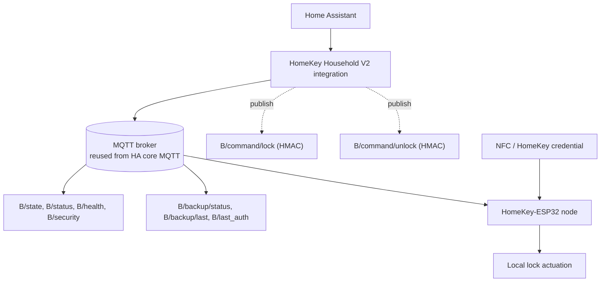

# HomeKey Household — Home Assistant V2 Integration

Home Assistant custom integration (`homekey_household`) for the **HomeKey-ESP32
household MQTT API, firmware 0.10.0**.

> **Local HomeKey unlock remains entirely on the ESP32.** Home Assistant, MQTT,
> and internet connectivity are *not* dependencies for local HomeKey access. The
> ESP32 authenticates HomeKey credentials and actuates the lock locally; the path
> `NFC → LockManager → HomeKit` has no MQTT dependency. This integration is a
> **management and control plane**, not part of the local access path.

---

## 1. Architecture

The integration is a **client of the documented household MQTT API**. It is
logically separated from the firmware implementation and does not depend on ESP32
C++ classes, `LockManager` internals, HomeKey credential storage, HomeKit
internals, raw NVS, the firmware filesystem, or legacy MQTT command paths.



`B = homekey/household/<household_id>/nodes/<node_id>`

**Layering** — a single directional pipeline; entities never parse MQTT directly:

```
MQTT message → topic parser (mqtt.parse_topic)
             → payload validators (models)
             → coordinator (single source of truth)
             → entities (lock / binary_sensor / sensor)
```

### Module map

| Module | Responsibility |
|---|---|
| `const.py` | Domain, topic builders, HMAC constants, payload keys, enums |
| `models.py` | Strictly validated payload dataclasses |
| `command.py` | Key derivation, canonical input, HMAC-SHA256, nonce/request ids |
| `credential.py` | Secure command-key storage via HA `Store` |
| `mqtt.py` | Transport abstraction, topic parsing, command publication |
| `coordinator.py` | Node registry, state merge, availability, fail-closed commands |
| `entity.py` | Stable device identity + shared attributes |
| `lock.py` | Lock entity using the HMAC command topics |
| `binary_sensor.py` | Node online |
| `sensor.py` | Health, backup, security, firmware, last-auth |
| `config_flow.py` | Household + credential setup (reuses HA MQTT) |
| `diagnostics.py` | Redacted diagnostics |

**Transport**: the integration reuses the Home Assistant core **MQTT
integration**. It never opens a second broker connection and does not duplicate
broker configuration.

---

## 2. Installation

1. Copy `custom_components/homekey_household` into your Home Assistant
   `config/custom_components/` directory (or install via HACS).
2. Ensure the official **MQTT** integration is configured and connected.
3. Restart Home Assistant.
4. Add the integration: **Settings → Devices & Services → Add Integration →
   HomeKey Household**.

Requirements: Home Assistant 2024.x or newer (developed against 2026.9), and the
core MQTT integration. There are no third-party Python dependencies.

---

## 3. Configuration

### Config flow

The flow is a single step:

| Field | Required | Description |
|---|---|---|
| **Household ID** | yes | Matches `household_id` on the household topics, e.g. `HOME-001`. Charset `[A-Za-z0-9_-]{1,64}` |
| **Household name** | no | Friendly name; defaults to the household id |
| **Recovery secret** | no | Used **once** to derive the command key. Never stored, never logged, never sent over MQTT |
| **KDF salt** | no | Salt used by the firmware when deriving the command key |
| **Enable authenticated lock control** | no | Enables/disables lock commands (default on) |

MQTT broker details are **not** requested: the flow aborts with
`mqtt_not_configured` when the HA MQTT integration is unavailable, and otherwise
reuses it.

### Options flow

Re-open the integration and choose **Configure** to:

* rotate the command credential (supply the recovery secret again — leaving it
  blank keeps the current key),
* toggle authenticated lock control,
* change the legacy MQTT client-id prefix (default `ESP_`) used **only** to read
  the shared broker LWT availability topic.

### Credential boundary (important)

The firmware derives the command key as:

```
key = BLAKE2b( message = recovery_secret || salt,
               key     = "HK-HOUSEHOLD-CMD-v1",
               digest  = 32 bytes )
```

Home Assistant must be able to reproduce this key, so:

* the recovery secret is entered once, used **in memory** for derivation, then
  discarded;
* **only the derived 32-byte command key** is persisted, via the Home Assistant
  `Store` helper (`<config>/.storage/homekey_household.command_keys`);
* the raw recovery secret, raw backup, private keys, and HomeKey credentials are
  **never** stored in the config entry, MQTT topics, entity state, attributes,
  logs, or diagnostics.

If no credential is available and control is enabled, the lock entity is
read-only and every command **fails closed** — an unauthenticated command is
never published.

---

## 4. Household setup

A *household* is an independent namespace. Multiple households can be configured
in one Home Assistant instance and never collide.

Nodes are enrolled on the node side (via the firmware's HTTP provisioning
endpoints). Once enrolled, the node publishes under
`homekey/household/<household_id>/nodes/<node_id>/`.

---

## 5. Node discovery

**Authoritative registration path (chosen and documented):** the integration
registers nodes itself by subscribing to the household namespace
(`homekey/household/#`) and observing the documented node topics. The first
message seen for a `(household_id, node_id)` pair registers that node.

* Discovery is **deterministic** and **idempotent**: republished or retained
  messages never create duplicate entities.
* Adding a node triggers a debounced reload so the new device appears without a
  Home Assistant restart.
* The firmware's own HA MQTT Discovery messages are **not** used for
  registration. This is deliberate: the firmware's discovery payloads share a
  single device descriptor based on `deviceID`/MAC, which cannot express the
  required `household_id + node_id` identity model or multi-node isolation. The
  integration therefore implements one authoritative registration path and does
  not create duplicate entities for firmware-discovered ones.

Users do **not** configure nodes manually.

---

## 6. Entities

All entities are attached to a stable device per node. Unique ids follow the
documented contract: `<household_id>_<node_id>_<entity>`.

| Entity | Platform | Unique id | State source | Notes |
|---|---|---|---|---|
| **Lock** | `lock` | `<hid>_<nid>_lock` | `B/health.lock_current` | Controlled via HMAC `B/command/*` |
| **Node online** | `binary_sensor` | `<hid>_<nid>_online` | `B/status` (`online`/`offline`) | `availability_topic` = shared LWT |
| **Node health** | `sensor` | `<hid>_<nid>_health` | `B/health.mqtt` (`OK`/`ERROR`) | Full health JSON as attributes |
| **Backup status** | `sensor` | `<hid>_<nid>_backup` | `B/backup/last.status` | Full metadata JSON as attributes |
| **Security status** | `sensor` | `<hid>_<nid>_security` | `B/security` (`OK`/`WARNING`) | Raw string, never numeric |
| **Firmware version** | `sensor` | `<hid>_<nid>_firmware` | `B/state.firmware_version` | `generation` as an attribute |
| **Last HomeKey authentication** | `sensor` | `<hid>_<nid>_last_auth` | `B/last_auth.result` (`SUCCESS`/`FAILURE`) | Safe metadata only |

### Semantics preserved exactly

* **Security** is exposed as the documented string `OK` / `WARNING`. It is *not*
  converted into a numeric security score, and no additional classifications are
  invented. (`ERROR` is reserved by the firmware and tolerated defensively.)
* **Health** uses the documented `mqtt` field as its value. `network` is always
  `UNKNOWN` and `certificate` always `unknown` in firmware 0.10.0; both are
  reported **verbatim** and never fabricated from unrelated Home Assistant data.
* **Backup** uses the metadata topic only. The integration never expects or
  accepts backup *contents* over MQTT.
* **Last auth** expects only `type`, `result`, `timestamp`. Issuer/endpoint ids,
  APDU data, credential ids, and cryptographic material are never expected.

### Lock state

Lock state is derived from `B/health.lock_current` (the documented household
state source) mapped as `0=unlocked, 1=locked, 2=jammed, 3=unknown,
4=unlocking, 5=locking`. With no health snapshot yet, the state is `unknown`.

---

## 7. Lock control (HMAC-authenticated)

Authoritative control uses **only**:

```
B/command/lock
B/command/unlock
```

Legacy/internal topics are **not** used for control:

* `P/homekit/set_state`
* `P/homekit/set_target_state`
* `P/homekit/set_current_state`
* `P/homekit/set_battery_lvl`
* `P/homekit/set_custom_state`

### Command payload

Exactly four fields. **The action is not in the payload** — it is derived from
the MQTT topic.

```json
{"ts": 1760000000, "nonce": "<nonce>", "req_id": "<request-id>", "mac": "<64 lowercase hex characters>"}
```

### MAC computation

```
lock:   mac = HMAC-SHA256(key, f"{ts}{nonce}{req_id}lock")
unlock: mac = HMAC-SHA256(key, f"{ts}{nonce}{req_id}unlock")
```

* `ts` — Unix epoch seconds from the Home Assistant system clock (decimal, no
  separator). The firmware accepts roughly ±300 s.
* `nonce` — 16 random bytes rendered as lowercase hex (32 chars), from a CSPRNG
  (`secrets`). The client never reuses a nonce within the firmware's replay
  window. Nonces are **never** predictable counters.
* `req_id` — a unique, secret-free UUID hex string, for local correlation and
  debugging.
* The command is published at **QoS 1** and **not retained**.

### Fail-closed behaviour

* No credential → the command is not published and the entity raises
  `HomeAssistantError`.
* No MQTT transport → the command is not published.
* An `unlock=true` shortcut does not exist anywhere in the code path.

---

## 8. Multi-node and device identity

The stable logical identity is **`household_id + node_id`**.

```
Household HOME-A          Household HOME-B
├── GATE-001              └── GATE-001
├── HOUSE-001
└── SMALL-001
```

These never collide: entity unique ids, MQTT topics, and device identifiers all
incorporate both the household and the node id.

Device identifiers are `(homekey_household, household_id, node_id)`. The
integration deliberately **does not** use the MAC address or the HomeKit
`deviceID` as the primary identity, because:

* `deviceID` can change when a device is re-paired in Apple Home,
* a MAC-based identity cannot express the household/node model,
* the firmware's own discovery device descriptor collapses all household nodes
  onto one device.

### Replacement nodes

`GATE-001 → GATE-002` is treated as a **new node identity**. It produces a
distinct MQTT topic space, a distinct HA device, and distinct entities. The old
device becomes unavailable and can be removed from the device registry;
configuration and automations for the new node are separate. Re-provisioning
Apple Home is required on the device side (a documented firmware limitation).

---

## 9. Availability

Node availability follows the documented status/LWT semantics:

| Signal | Topic | Payload | Source |
|---|---|---|---|
| Node status | `B/status` | `online` / `offline` | Node publish (retained) |
| Shared LWT | `<CLIENT_ID>/status` | `online` / `offline` | Broker will on unexpected disconnect |

* The node-online entity is `on` when `B/status` reports `online`.
* The shared broker LWT is consumed as an availability signal, so an unexpected
  disconnect marks entities unavailable.
* **No second MQTT will is created** — MQTT allows only one will per connection.
* **Known limitation (documented, not worked around):** a *clean* MQTT disconnect
  can leave the retained `online` state until another connection or will event.
  The integration does **not** hide this by inventing a timer-based fake offline
  state.
* The LWT topic is MAC-derived and carries no household identity, so it can never
  create a household entity on its own.

---

## 10. State handling

Payloads are validated strictly and defensively:

* Malformed JSON, wrong types, and identity mismatches are rejected with a
  warning; the integration never crashes and never corrupts entity state.
* A rejected payload **preserves the previous valid state**.
* Missing fields are **not** interpreted as valid zero/false values unless the
  contract defines that behaviour. For example a missing `lock_current` yields
  `unknown`, not `locked`/`unlocked`; a missing optional boolean stays `None`.
* Booleans are never accepted where integers are required (Python's `bool`
  subclassing `int` is explicitly rejected).
* Identity fields are required on `state` (the contract always includes them) and
  validated-if-present on `health`, `backup/last`, and `last_auth` (the firmware
  omits them on `health`).

---

## 11. Reserved and HTTP-only APIs

The firmware marks these topics **RESERVED / NOT IMPLEMENTED**. The integration
never subscribes to or publishes them (the parser flags and drops them):

| Topic | Status |
|---|---|
| `B/events` | RESERVED / NOT IMPLEMENTED |
| `B/backup/request` | RESERVED / NOT IMPLEMENTED |
| `B/backup/data` | RESERVED / NOT IMPLEMENTED |
| `B/restore/request` | RESERVED / NOT IMPLEMENTED |
| `B/restore/status` | RESERVED / NOT IMPLEMENTED |

**Backup, restore, audit, and provisioning are HTTP-only** on the firmware
(`POST /backup/create`, `POST /backup/restore`, `GET /audit`). If backup or
restore integration is added later it must use those documented HTTP APIs — not
invented MQTT topics. Encrypted backup blobs are never published over MQTT, and
this integration never expects them there.

---

## 12. Logging

Logged (safe): `household_id`, `node_id`, command type, success/failure, MQTT
topic, request id.

**Never logged:** the HMAC command key, the recovery secret, the raw command MAC,
backup plaintext, private keys, HomeKey credential material.

Diagnostics output is redacted recursively (`recovery_secret`, `command_key`,
`key`, `mac`, `backup`, `data`, `private_key`, tokens, …). A one-way key
fingerprint (first 8 hex chars of SHA-256 over the key) may be shown; it cannot
be used to sign commands.

---

## 13. Troubleshooting

| Symptom | Likely cause / fix |
|---|---|
| Setup aborts with *MQTT not configured* | Configure and connect the core MQTT integration first |
| No nodes appear | Node not enrolled in the household; check `homekey/household/<hid>/nodes/+/state` is being published (retained) |
| Entities unavailable | `B/status` is `offline`, or the shared LWT published `offline` |
| Entities stay available after a clean disconnect | Documented MQTT clean-disconnect limitation — not a bug (see §9) |
| `Cannot lock/unlock … credential unavailable` | No command key stored. Open **Configure** and supply the recovery secret |
| Lock never changes state | Node not publishing `B/health`; lock state comes from `lock_current` |
| Security shows `WARNING` | Firmware security posture has a finding — check the Web UI / firmware security checks |
| `network` is `UNKNOWN` / `certificate` is `unknown` | Documented firmware stubs (not wired); working as intended |
| Backup entity shows no timestamp | The node has not published `B/backup/last` yet |
| Commands appear ignored | Check `req_id` in the logs; the firmware rejects bad MACs, replayed nonces, and timestamps outside ±300 s |

Debug logging:

```yaml
logger:
  logs:
    custom_components.homekey_household: debug
```

---

## 14. Contract compliance summary

| Contract requirement | Implementation |
|---|---|
| Household-only topics | `const.py` declares only documented topics; reserved topics are explicitly rejected |
| No `schema` field required | `models.py` does not require one |
| `B/security` raw string | Stored and exposed as `OK` / `WARNING`, never numeric |
| `B/health` stubs preserved | `network`/`certificate` reported verbatim |
| Backup metadata only | Only `status`/`timestamp` modelled |
| `last_auth` safe metadata | Only `type`/`result`/`timestamp` modelled |
| HMAC command payload | Exactly 4 fields, no `action` |
| Topic-derived action | `COMMAND_ACTIONS` maps topic → action |
| Key derivation | BLAKE2b(`secret || salt`, key=label, 32) |
| MAC | HMAC-SHA256 over `{ts}{nonce}{req_id}{action}`, lowercase hex |
| Timestamp | Unix epoch seconds from the HA clock |
| Freshness/replay | CSPRNG nonce, never reused; ~±300 s window respected |
| Fail closed | No credential ⇒ no publish |
| One MQTT will | Shared LWT reused, no second will |
| Multi-node / multi-household | Identity is `household_id + node_id` throughout |
| Legacy topics excluded | No `P/*` command topic published; `P/homekey/auth` unused for V2 auth |
